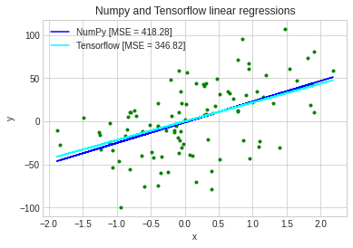
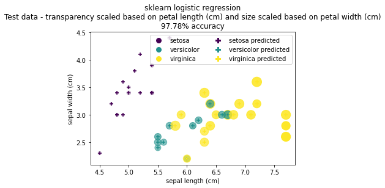

Various implementations of common machine learning algorithms

# Linear Regression
Closed form solution compared to tensorflow implementation:

# Logistic Regression
scikit-learn implementation using iris dataset

