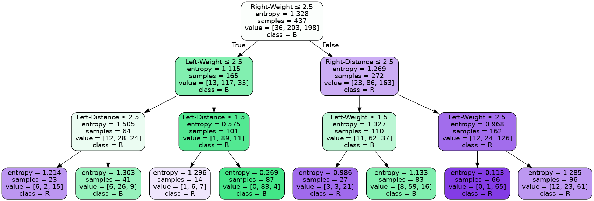

# Common machine learning algorithms

Various implementations of common machine learning algorithms

# Supervised Learning

## Regression

### Linear Regression
Closed form solution compared to tensorflow implementation and scikit-learn LASSO and Ridge regressions:

|  |
|:--:| 
| *Example linear regression output* |

## Classification

### Cancer Dataset - Naive Bayes, SVM, and Logistic Regression

#### Naive Bayes

Full dataset: 
```console
Accuracy: 89.47%
```

But let us check the correlation of features and try to gain some improvement:

|  |
|:--:| 
| *Feature correlation heatmap for cancer dataset* |

```console
Accuracy after removing 3 most highly correlated features: 91.23%
Dropped features: mean perimeter, mean radius, mean area
```

After dimensionality reduction leads accuracy to approach closed form solution, dropping additional features causes accuracy to degrade again, quickly dropping below the original value

|  |
|:--:| 
| *Naive Bayes classification results for cancer dataset* |

#### Logistic Regression

Comparison of numpy closed form solution to scikit-learn implementation using cancer dataset

|  |
|:--:| 
| *Logistic regression classification results for cancer dataset* |

#### Support Vector machine

Initial run with raw dataset

```console
Accuracy: 96.49%
```

Let us see if normalization can buy us any improvements:

```console
Accuracy: 98.83%
```

|  |
|:--:| 
| *SVM classification results for cancer dataset* |

### Iris Dataset - K-nearest neighbors

sci-kit learn implementation using iris dataset

#### Descriptive visualizations of dataset

Print the descriptive statistics on the dataset:

```python
df.info()
```

```console
Data columns (total 5 columns):
 #   Column             Non-Null Count  Dtype  
---  ------             --------------  -----  
 0   sepal length (cm)  150 non-null    float64
 1   sepal width (cm)   150 non-null    float64
 2   petal length (cm)  150 non-null    float64
 3   petal width (cm)   150 non-null    float64
 4   target             150 non-null    float64
dtypes: float64(5)
memory usage: 6.0 KB
```

```python
print(df.describe())
```

```console
       sepal length (cm)  sepal width (cm)  petal length (cm)  petal width (cm)      target
count         150.000000        150.000000         150.000000        150.000000  150.000000
mean            5.843333          3.057333           3.758000          1.199333    1.000000
std             0.828066          0.435866           1.765298          0.762238    0.819232
min             4.300000          2.000000           1.000000          0.100000    0.000000
25%             5.100000          2.800000           1.600000          0.300000    0.000000
50%             5.800000          3.000000           4.350000          1.300000    1.000000  
75%             6.400000          3.300000           5.100000          1.800000    2.000000   
max             7.900000          4.400000           6.900000          2.500000    2.000000
```

and map the correlation between features in the dataset:

|   |
|:--:| 
| *Correlation matrix* |

#### Tune Hyperparameters

Use cross validation to determine optimal k (number of nearest neighbors):

|  |
|:--:| 
| *k values vs. accuracy* |

#### Predictions

|  |
|:--:| 
| *Pair plots for predicted classes* |

### Balance Dataset - Decision Tree

Compare Gini and entropy criterion:

```console
Accuracy Gini criterion: 73.4%
Accuracy Entropy criterion: 70.74%
```

Decision tree graphs for each criterion:

|  |
|:--:| 
| *Gini tree graph* |

|  |
|:--:| 
| *Entropy tree graph* |

# Unsupervised Learning

## K-means clustering

Implementation of k-means clustering using scikit learn and randomly generated blobs for test dataset

|  |
|:--:| 
| *K-means clustering on random blobs* |

