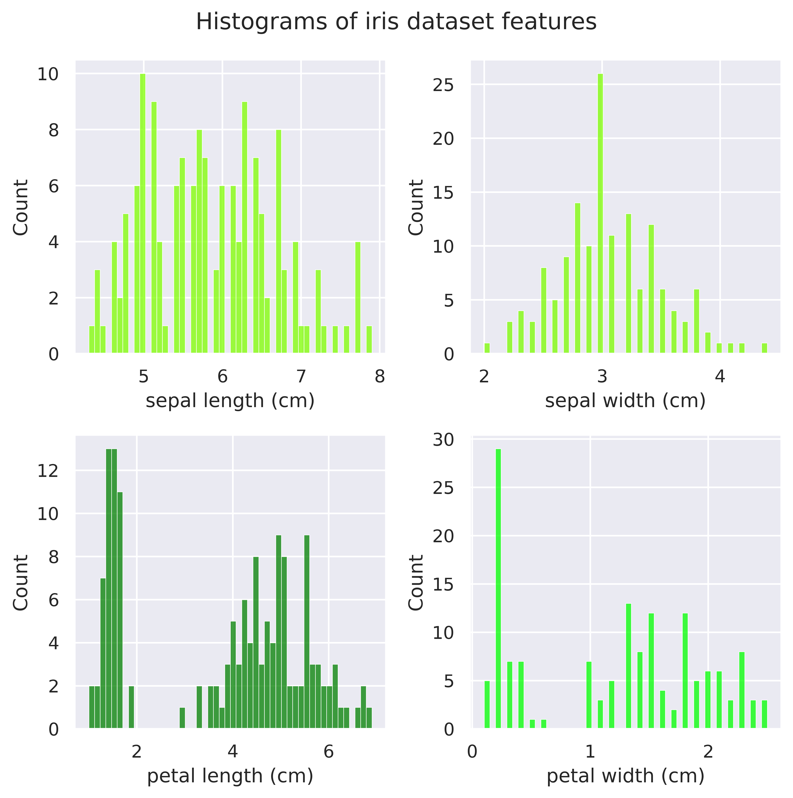

# Common machine learning algorithms

Various implementations of common machine learning algorithms

## Linear Regression
Closed form solution compared to tensorflow implementation:

|  |
|:--:| 
| *Example linear regression output* |

## Logistic Regression
scikit-learn implementation using iris dataset

|  |
|:--:| 
| *Logistic regression classification of iris dataset* |

## K-nearest neighbors

sci-kit learn implementation using iris dataset

### Descriptive visualizations of dataset

Print the descriptive statistics on the dataset:

```python
df.info()
```

```console
Data columns (total 5 columns):
 #   Column             Non-Null Count  Dtype  
---  ------             --------------  -----  
 0   sepal length (cm)  150 non-null    float64
 1   sepal width (cm)   150 non-null    float64
 2   petal length (cm)  150 non-null    float64
 3   petal width (cm)   150 non-null    float64
 4   target             150 non-null    float64
dtypes: float64(5)
memory usage: 6.0 KB
```

```python
print(df.describe())
```

```console
       sepal length (cm)  sepal width (cm)  petal length (cm)  petal width (cm)      target
count         150.000000        150.000000         150.000000        150.000000  150.000000
mean            5.843333          3.057333           3.758000          1.199333    1.000000
std             0.828066          0.435866           1.765298          0.762238    0.819232
min             4.300000          2.000000           1.000000          0.100000    0.000000
25%             5.100000          2.800000           1.600000          0.300000    0.000000
50%             5.800000          3.000000           4.350000          1.300000    1.000000  
75%             6.400000          3.300000           5.100000          1.800000    2.000000   
max             7.900000          4.400000           6.900000          2.500000    2.000000
```

and visualize the distributions and relationships between features in the dataset:

| |
|:--:| 
| *Histograms* |

|   |
|:--:| 
| *Correlation matrix* |

|  |
|:--:| 
| *Pair plots* |

### Tune Hyperparameters

Use cross validation to determine optimal k (number of nearest neighbors):

|  |
|:--:| 
| *k values vs. accuracy* |

## Predictions
|  |
|:--:| 
| *Pair plots for predicted classes* |