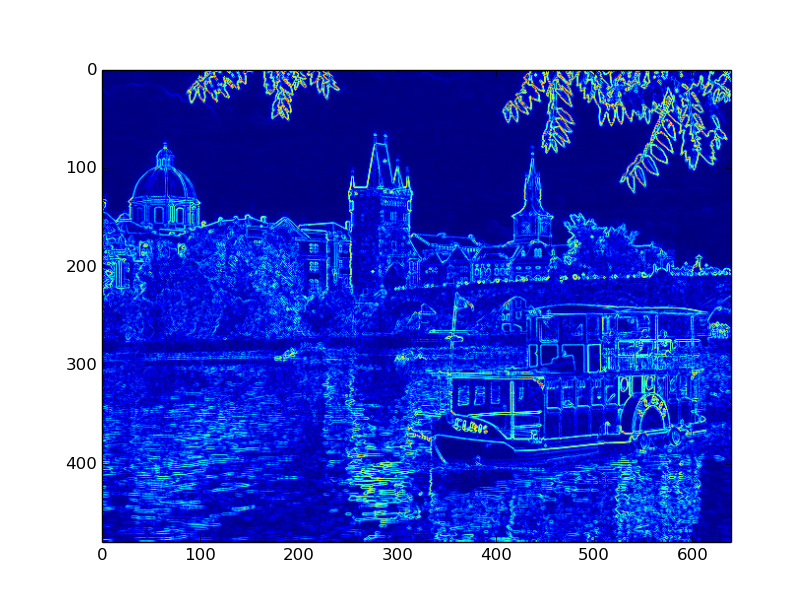
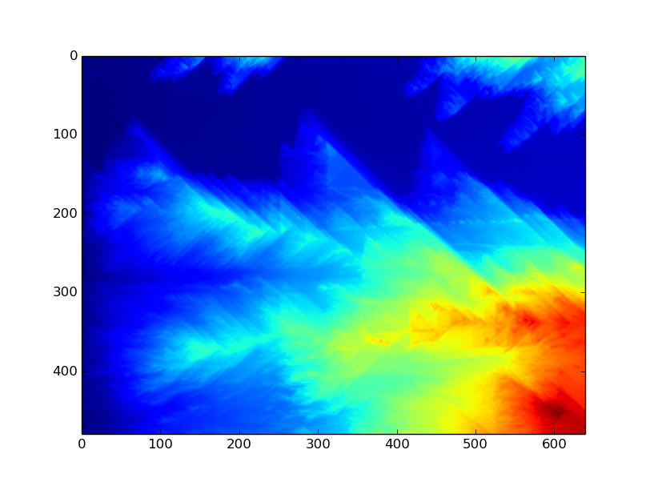
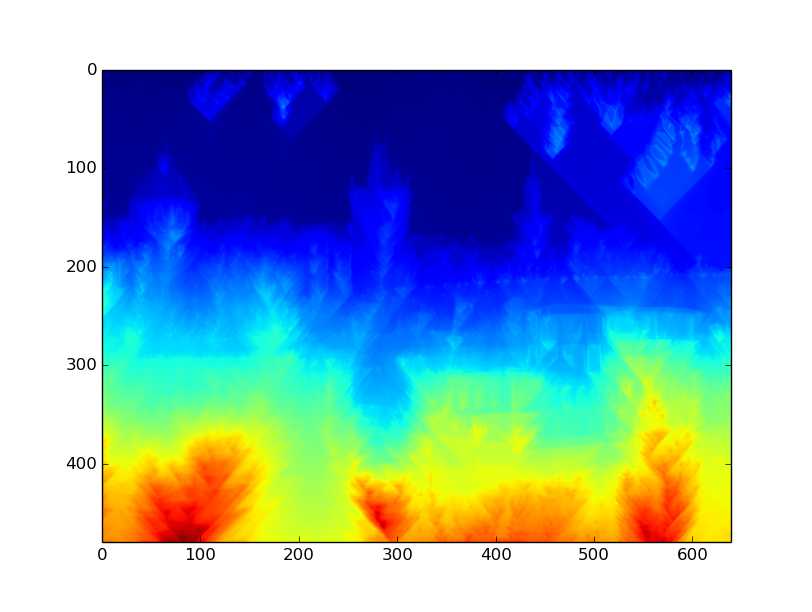
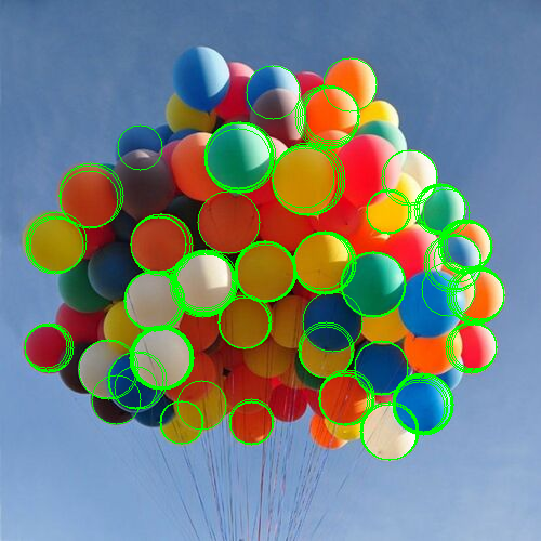
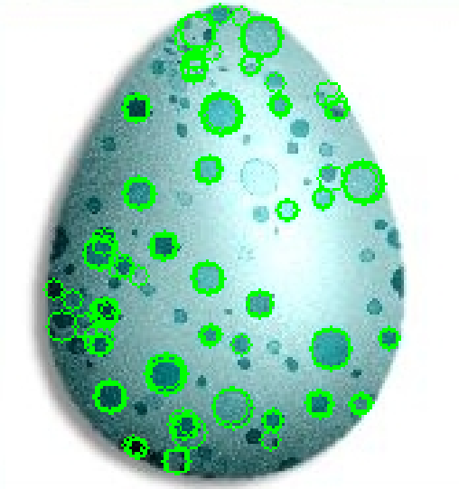

# Computer Vision

Top level directory for various computer vision implementations

## Seam Carving

Content aware image re-sizing (Avidan and Shamir [2007](http://graphics.cs.cmu.edu/courses/15-463/2012_fall/hw/proj3-seamcarving/imret.pdf)) is accomplished by applying an energy function to an image, and further calculating the gradient of said
function either on the horizontal or vertical... optimal seam to remove can then be determined from gradient values.

|  |
|:--:| 
| *Input image* |

|  |
|:--:| 
| *Energy map* |

|  |  |
|:--:| 
| *Horizontal and vertical gradient images* |

|  |  |
|:--:| 
| *Reduced size output images* |

## Circle Detection

Canny edge detector generates a binary image from the input, and then applies Hough Transform to detect
the centers of circles with radius in provided range. 

|  |
|:--:| 
| *Circles detected in balloons test image* |

|  |
|:--:| 
| *Circles detected in egg test image* |