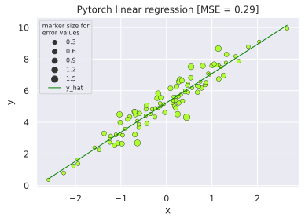
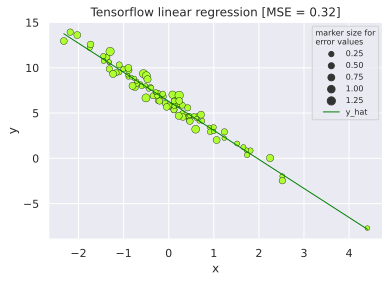
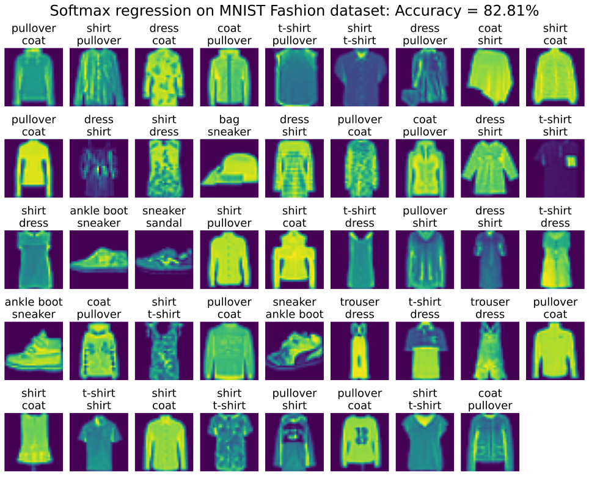
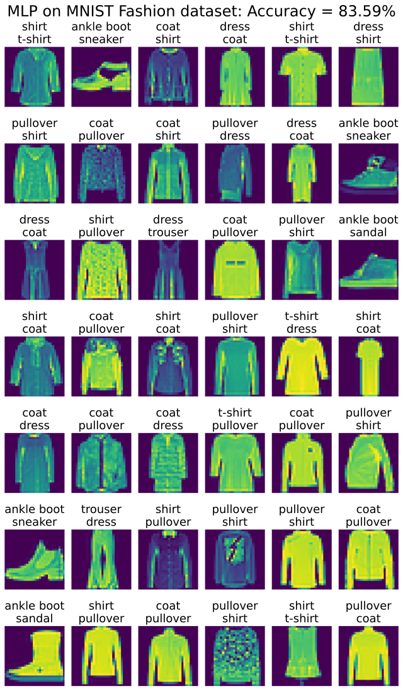

# Deep Learning
Examples of common methodologies in deep learning, implemented in pytorch and tensorflow

## Linear Regression
Visualizations generated from pytorch and tensorflow implementations.

|  |
|:--:| 
| *Pytorch linear regression output* |

|  |
|:--:| 
| *Tensorflow linear regression output* |

## Softmax Classifier
|  |
|:--:| 
| *Pytorch softmax classifier mis-labeled images* |

## MLP Classifier
|  |
|:--:| 
| *Tensorflow MLP classifier mis-labeled images* |