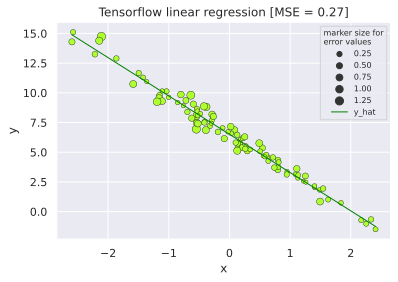
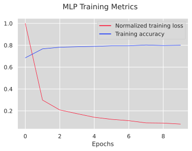
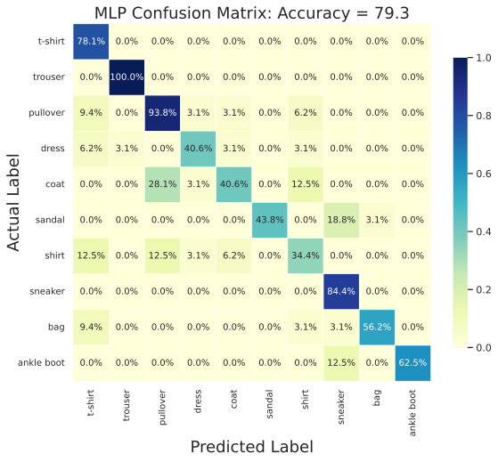
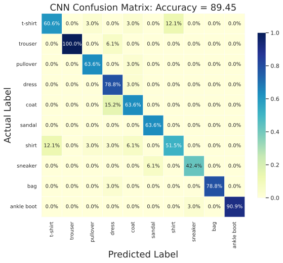
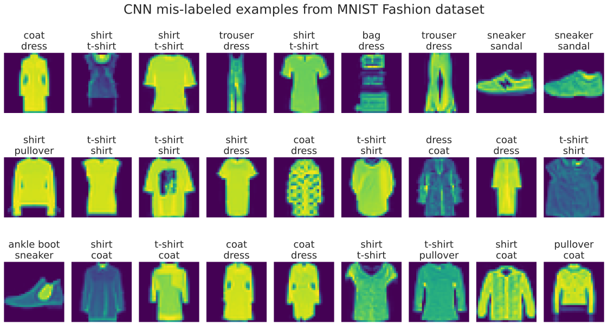
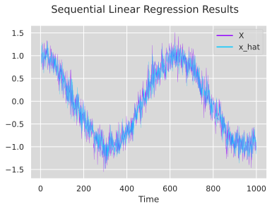

# Deep Learning
Examples of common methodologies in deep learning, implemented in pytorch and tensorflow

## Linear Regression
Visualizations generated from pytorch and tensorflow implementations.

|  |
|:--:| 
| *Pytorch linear regression output* |

|  |
|:--:| 
| *Tensorflow linear regression output* |

## MNIST Fashion Dataset - Softmax Classifier, MLP, and CNN

Comparison of classification results on MNIST Fashion dataset between pytorch softmax classifier, tensorflow MLP, and pytorch CNN.

### Softmax Classifier

First, the softmax results:

|  |
|:--:| 
| *Pytorch softmax classifier training metrics* |

|  |
|:--:| 
| *Pytorch softmax classifier results* |

### MLP

Let us extend this line of action (switching to tensorflow for implementation), and add a hidden layer...

|  |
|:--:| 
| *Tensorflow MLP network structure* |

Results demonstrate a positive trend in accuracy:

|  |
|:--:| 
| *Tensorflow MLP training metrics* |

|  |
|:--:| 
| *Tensorflow MLP results* |

So if adding a 1D layer is good, adding a 2D layer is better, right???

### CNN

Finally, a CNN implementation in pytorch (generally follows LeNet architecture, but substititutes relu activation function and adds batch normalization):

|  |
|:--:| 
| *Pytorch CNN training metrics* |

|  |
|:--:| 
| *Pytorch CNN results* |

Displayed below are examples of mis-labeled elements of the validation dataset:

|  |
|:--:| 
| *Pytorch CNN mis-labeled image examples - correct label above, incorrect label below* |

## Recurrent Neural Networks
Let's take a look at a basic regression on sequential data: construct a feature vector using $\tau$ previous values $x_{t-1},...,x_{t-\tau}$ for label $x_t$

|  |
|:--:| 
| *Tensorflow sequential linear regression results* |